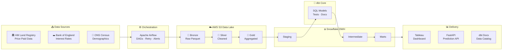
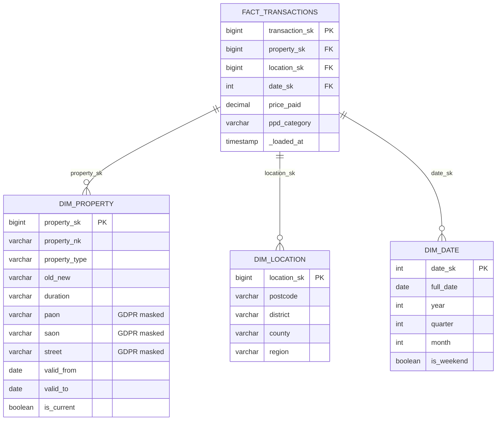

# 🏠 UK Real Estate Market Analytics

> [!TIP]
> 📖 **[Recruiter & Tech Lead: How to View/Run this Project?](PRESENTATION_GUIDE.md)**

## 📸 Visual Showcase

| Interactive Dashboard | Data Lineage (dbt) | API Documentation |
|:---:|:---:|:---:|
|  |  |  |

---

> End-to-end data engineering pipeline for UK property market intelligence — from raw government data to executive dashboards.


---

## 📋 Overview

This project demonstrates a **production-grade data pipeline** processing UK property transactions from the HM Land Registry, combined with Bank of England interest rates and ONS demographics data.

It's designed to showcase real-world data engineering skills:

| Concept | Implementation |
|---|---|
| **Medallion Architecture** | Bronze → Silver → Gold layers in S3 + Snowflake |
| **Incremental Loads** | Watermark-based with merge strategy |
| **SCD Type 2** | Full history tracking for property dimensions |
| **GDPR Compliance** | Dynamic data masking in Snowflake (UK requirement) |
| **Cost Optimisation** | Right-sized virtual warehouses with auto-suspend |
| **Data Quality** | Great Expectations + dbt tests at every layer |
| **Infrastructure as Code** | Terraform for S3, IAM, and Snowflake resources |
| **CI/CD** | GitHub Actions: lint → test → dbt compile → deploy |

## 🏗️ Architecture



## 📁 Project Structure

```
uk-real-estate-analytics/
├── ingestion/                  # Python ingestion scripts
│   ├── config.py               # Central configuration (URLs, schemas, settings)
│   ├── land_registry.py        # HM Land Registry Price Paid Data
│   ├── boe_rates.py            # Bank of England interest rates
│   ├── ons_demographics.py     # ONS housing & demographics
│   └── utils/
│       ├── s3_client.py        # S3/local storage abstraction
│       └── logging_config.py   # Structured JSON logging
├── orchestration/
│   └── dags/                   # Airflow DAG definitions
├── snowflake/
│   └── setup/                  # DDL: databases, warehouses, RBAC, masking
├── dbt_project/
│   └── models/
│       ├── staging/            # 1:1 source mapping, type casting
│       ├── intermediate/       # Business logic joins
│       └── marts/              # Star schema for consumption
├── terraform/                  # S3 + Snowflake IaC
├── api/                        # FastAPI prediction endpoint
├── tests/                      # pytest + Great Expectations
├── DECISIONS.md                # Architectural Decision Records
├── Makefile                    # Developer shortcuts
└── README.md                   # ← You are here
```

## 🚀 Quick Start

### Prerequisites

- Python 3.10+
- (Optional) AWS account with S3 access
- (Optional) Snowflake account (free trial works)

### Setup

```bash
# Clone the repository
git clone https://github.com/YOUR_USERNAME/uk-real-estate-analytics.git
cd uk-real-estate-analytics

# Create virtual environment
python -m venv .venv
.venv\Scripts\activate        # Windows
# source .venv/bin/activate   # macOS/Linux

# Install dependencies
pip install -r requirements.txt

# Configure environment
copy .env.example .env
# Edit .env with your settings (local mode works out of the box)
```

### Run Ingestion

```bash
# Ingest 2024 Land Registry data (default, ~150MB download)
python -m ingestion.land_registry

# Ingest specific years
python -m ingestion.land_registry --years 2022,2023,2024

# Full refresh (re-download existing partitions)
python -m ingestion.land_registry --full-refresh
```

### Output

Data is saved to `data/bronze/land_registry/year=2024/data.parquet` in Hive-style partitions:

```
data/
└── bronze/
    └── land_registry/
        ├── year=2022/data.parquet
        ├── year=2023/data.parquet
        └── year=2024/data.parquet
```

### Transform Data (Snowflake + dbt)

If you have Docker installed, you can build the entire warehouse architecture with one command:

```bash
# Build all tables, snapshots (SCD2), and run tests
docker run --rm -it -v ${PWD}:/usr/app -w /usr/app/dbt_project --env-file .env ghcr.io/dbt-labs/dbt-snowflake:1.7.latest build
```

### Run the Prediction API (FastAPI)

Once the data is transformed in Snowflake, launch the serving layer:

```bash
# Start the local FastAPI server
python -m uvicorn api.main:app --reload
```

Open **http://127.0.0.1:8000/docs** in your browser to test the price estimation engine!

### Run Tests

```bash
python -m pytest tests/ -v
```

## 📊 Data Sources

| Source | Format | Frequency | License | Records |
|---|---|---|---|---|
| [HM Land Registry PPD](https://www.gov.uk/government/statistical-data-sets/price-paid-data-downloads) | CSV (no headers) | Monthly | OGL | ~28M (since 1995) |
| [Bank of England Rates](https://www.bankofengland.co.uk/boeapps/iadb/) | CSV (via IADB) | Daily | OGL | ~1.2K rate changes |
| [ONS Demographics](https://api.beta.ons.gov.uk/v1) | CSV/JSON API | Varies | OGL | Per dataset |

> **Note:** All data sources are genuinely open under the Open Government Licence. No web scraping is used — see [DECISIONS.md](DECISIONS.md#002-no-rightmove-scraping) for rationale.

### Visualization & Documentation (Phase 6)

#### 📊 Interactive Dashboard (Streamlit)
To see the processed data in action with charts and KPIs, run:
```bash
python -m streamlit run dashboard.py
```
This connects live to Snowflake and visualizes market trends, median prices, and transaction volumes.

#### 🗺️ Data Lineage (dbt Docs)
To view the "Map of the Mine" (how your data flows from raw to gold), run:
```bash
# Generate and serve the interactive lineage graph
docker run --rm -it -p 8080:8080 -v ${PWD}:/usr/app -w /usr/app/dbt_project ghcr.io/dbt-labs/dbt-snowflake:1.7.latest docs serve --port 8080
```
Then open **http://localhost:8080** to see the Documentation and Lineage graph.



## 🔒 GDPR Compliance

Address-level fields (PAON, SAON, Street) are protected with Snowflake Dynamic Data Masking:

| Role | Address Fields | Postcode |
|---|---|---|
| `DATA_ENGINEER` | Full access | Full access |
| `DATA_GOVERNANCE` | Full access | Full access |
| `ANALYST` | `***MASKED***` | Full access |
| Others | `***REDACTED***` | Partial (sector only) |

See [snowflake/setup/05_masking_policies.sql](snowflake/setup/05_masking_policies.sql) for implementation.

## 🧠 Key Engineering Decisions

All architectural decisions are documented in [DECISIONS.md](DECISIONS.md) using the ADR format. Highlights:

1. **Parquet over CSV** for bronze layer (compression, schema, performance)
2. **No Rightmove data** (ToS compliance — ethical engineering)
3. **Medallion over Data Vault** (simpler for this scope, but aware of Data Vault 2.0)
4. **dbt Core over Cloud** (cost, CI/CD control, portability)
5. **Star schema with SCD-2** (balances query performance with history tracking)

## 📈 Interview Talking Points

This project is designed to facilitate deep technical conversations about:

- **Medallion Architecture**: Bronze → Silver → Gold with clear quality gates
- **Incremental Loading**: Watermark columns + MERGE strategy for efficiency
- **SCD Type 2**: Temporal history with `valid_from`/`valid_to` date ranges
- **Cost Optimisation**: WH auto-suspend, clustering keys, result caching
- **Data Contracts**: Schema validation enforced at bronze and silver boundaries
- **GDPR/Data Governance**: Dynamic masking, RBAC, and audit logging

## 📄 License

This project is for portfolio/educational purposes. Data sources are used under the [Open Government Licence](https://www.nationalarchives.gov.uk/doc/open-government-licence/version/3/).
